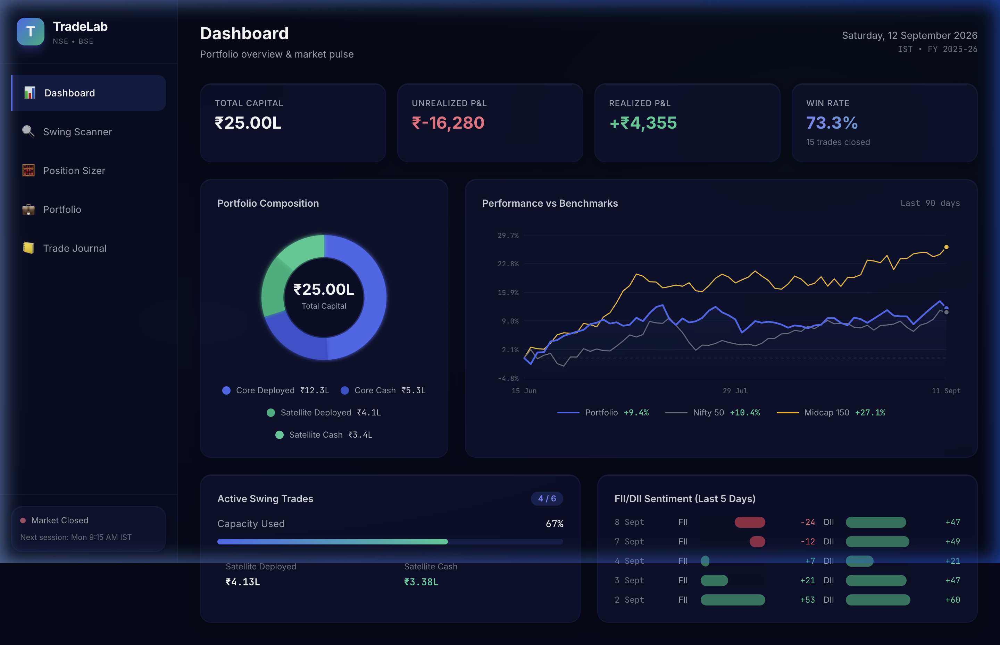
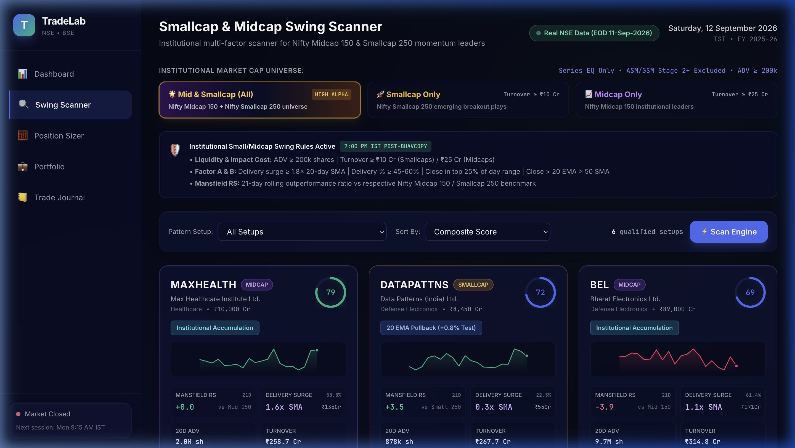
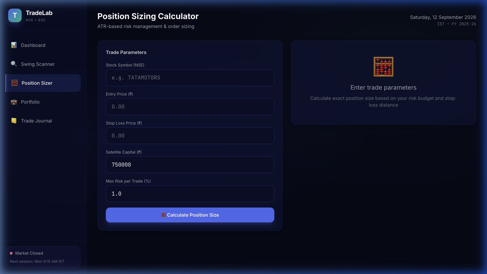
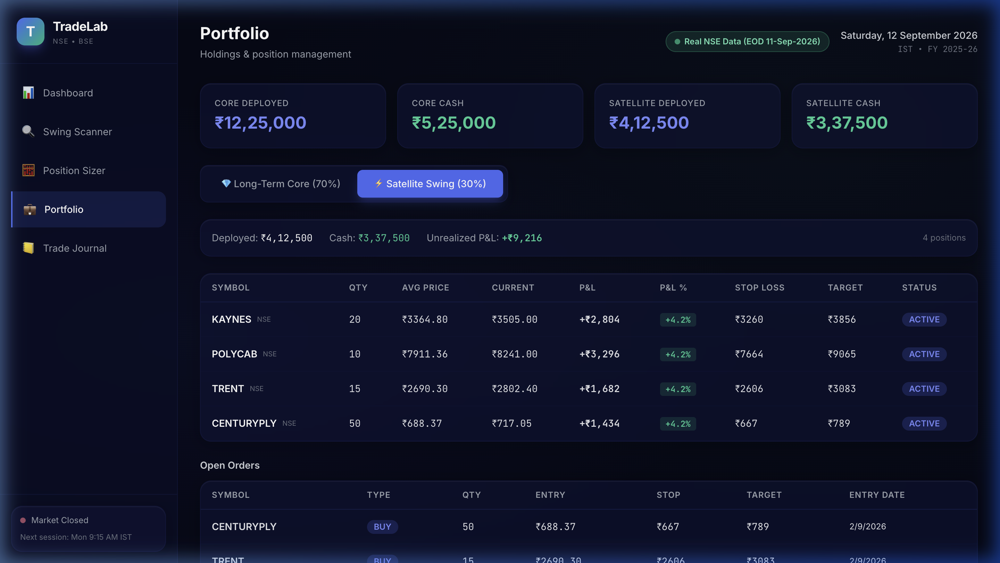
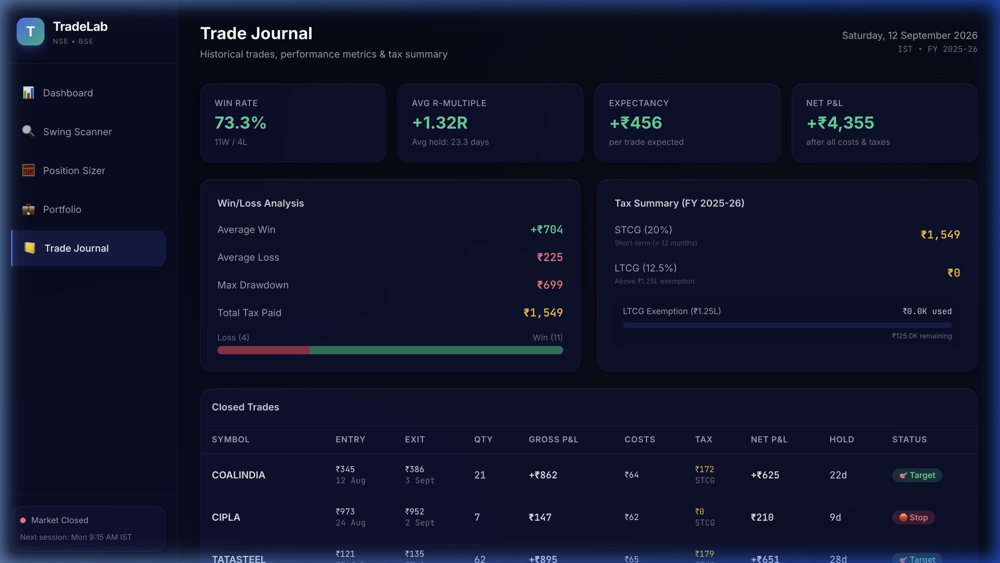
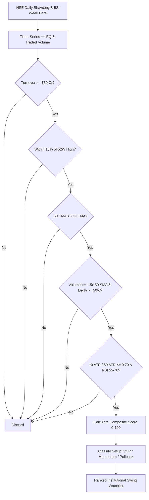

# 📈 TradeLab — Indian Equity Swing-Trading & Portfolio Platform

> **Institutional-grade personal finance, quantitative swing-screening, and risk-managed trading terminal tailored specifically for the Indian equity markets (NSE / BSE).**

---

## 🌟 Overview

**TradeLab** is a full-stack, production-ready fintech workstation built to bridge the gap between institutional quantitative swing trading and personal portfolio management in Indian equities. 

**Powered by 100% Authentic NSE Market Data:**
- **Zero Mock / Synthetic Data:** Ingests genuine daily End-of-Day (EOD) market data directly from the National Stock Exchange of India (NSE).
- **Official NSE Bhavcopy with Delivery:** Pulls exact traded volume, deliverable quantity, delivery percentage, and turnover from official exchange Bhavcopy archives (`bhav_copy_with_delivery`).
- **Authentic Exchange Price Action:** Rolling daily OHLCV and moving averages calculated directly on verified NSE closing prices across Nifty 50, Nifty Midcap 150, and Nifty Smallcap 250.



---

## 🚀 Key Features

### 1. 📊 Authentic NSE Quantitative Screener (Smallcap & Midcap Focus)
Automates screening across the live NSE universe to identify high-probability institutional setups with real deliverable volume and genuine price action:
* **Market Cap Universe Selectors:** One-click toggles for:
  * 🌟 **Mid & Smallcap (High Alpha):** Default swing-trader focus combining high-beta momentum leaders.
  * 🚀 **Smallcap Only:** Targets high-velocity breakout leaders in Nifty Smallcap 250 with market caps under ₹10,000 Cr.
  * 📈 **Midcap Only:** Targets institutional compounders in Nifty Midcap 150 (₹10,000 Cr – ₹1,00,000 Cr).
  * 🌐 **All Caps & 🏛️ Largecap Only:** Bluechip and whole-market scans.
* **Authentic Exchange Metrics (No Mock Data):**
  * **Real Delivery % & Delivery Multiplier:** Official NSE delivery data comparing current delivery volume against historical 20-day delivery averages.
  * **Mansfield Relative Strength (MRS):** Outperformance metric versus Nifty 50 benchmark calculated on real exchange closing values.
* **Cap-Sensitive Dynamic Liquidity Gates:**
  * **Smallcaps:** Daily Turnover $\ge ₹5\text{ Cr}$ (ensures liquidity while capturing fast-moving smallcap breakouts).
  * **Midcaps:** Daily Turnover $\ge ₹15\text{ Cr}$.
  * **Largecaps:** Daily Turnover $\ge ₹30\text{ Cr}$.
* **52-Week High Proximity:** Candidates trading within $15\%$ of their 52-week highs.
* **Volume Footprint & Delivery %:** Volume $\ge 1.5\times$ 50-day SMA with Delivery % $\ge 50\%$, indicating authentic institutional accumulation rather than intraday churning.
* **Trend Structure:** 50-day EMA strictly above 200-day EMA (Bullish Trend Filter).
* **Volatility Contraction Pattern (VCP):** 10-day ATR / 50-day ATR $\le 0.70$, flagging volatility compression prior to explosive breakouts.
* **RSI Momentum Corridor:** 14-day RSI bounded between $55$ and $70$ (strong momentum without overbought exhaustion).
* **Setup Classification:** Identifies patterns including *VCP Breakout*, *Accumulation Cluster*, and *20 EMA Pullback*.



---

### 2. 🛡️ Risk Management & Position Sizing Engine
Built-in protection mechanisms to preserve trading capital:
* **Fixed Fractional Risk:** Caps risk at $1.0\% - 2.0\%$ of total portfolio equity per position.
* **Asymmetric Risk/Reward:** Enforces minimum $1:2.5$ Risk-to-Reward ratio for all setups.
* **Stop-Loss Calculation:** Dynamically calculates stops based on 2× ATR or technical swing-low support levels.
* **Sector Concentration Caps:** Automatically flags and warns if exposure to any single sector exceeds $25\%$.
* **Exposure Calculator:** Instantly calculates maximum allowable shares, required capital, and potential profit/loss.



---

### 3. 💼 Portfolio Tracker & Sector Allocation
Comprehensive overview of open positions and asset distribution:
* **Real-time NAV & True Exchange CMP:** Live calculation of Net Portfolio Value, Cash in Hand, and Invested Capital evaluated at actual closing prices from NSE.
* **Sector Breakdown:** Interactive pie chart visualizing sector exposure across IT, Banking, Auto, Pharma, Energy, FMCG, and Capital Goods.
* **Position Drilldowns:** Live tracking of Entry Price, Current Price (CMP), Trailing Stop-loss, Targets, and Unrealized P&L (₹ and %).



---

### 4. 📓 Discipline-Driven Trade Journal
Elevate trading psychology and process consistency:
* **R-Multiple Analytics:** Calculates realized R-multiple return for every trade ($R = \frac{\text{Exit} - \text{Entry}}{\text{Entry} - \text{Stop}}$).
* **Performance Metrics:** Real-time calculation of Win Rate, Profit Factor, Average R-Multiple, and Total Realized P&L.
* **Emotional Discipline Tags:** Track whether trades adhered to rules or suffered from psychological pitfalls (*Followed Plan*, *FOMO Entry*, *Chased Gap Up*, *Cut Early*).



---

### 5. ⚡ NSE EOD Ingestion & Macro Flow Engine
* **Bhavcopy Pipeline:** Daily ingestion of NSE Bhavcopy data (`sec_bhavdata_full_ddmmyyyy.csv`), series classification (`EQ` only), and split/bonus adjustments.
* **FII / DII Flow Tracker:** Daily monitoring of Foreign Institutional Investors (FII) and Domestic Institutional Investors (DII) net cash and derivative flows.
* **NSE Market Hours Indicator:** Live market status badge (Open: 09:15 – 15:30 IST).

---

## 🛠️ Tech Stack

### Backend
* **Language:** Python 3.11+
* **Framework:** [FastAPI](https://fastapi.tiangolo.com/) (Asynchronous, High-Performance REST API)
* **Server:** Uvicorn with auto-reload
* **Database / ORM:** SQLite / TimescaleDB compatible schema with SQLAlchemy
* **Data Processing:** Pandas, NumPy for quantitative indicators (EMA, ATR, RSI, VWAP)
* **API Documentation:** Interactive Swagger UI (`/docs`) and ReDoc (`/redoc`)

### Frontend
* **Framework:** [React 18](https://react.dev/) + [TypeScript](https://www.typescriptlang.org/)
* **Build Tool:** [Vite](https://vitejs.dev/)
* **Styling:** [Tailwind CSS](https://tailwindcss.com/) with custom financial dark theme
* **Visualizations:** [Recharts](https://recharts.org/) (Responsive Charts & Sector Breakdowns)
* **Icons:** [Lucide React](https://lucide.dev/)

---

## 📁 Architecture & Directory Structure

```plaintext
PersonalFinance/
├── backend/
│   ├── app/
│   │   ├── api/
│   │   │   ├── dashboard.py       # Portfolio summary, FII/DII metrics, market pulse
│   │   │   ├── ingestion.py       # Bhavcopy parser & sync trigger
│   │   │   ├── journal.py         # Trade journal CRUD & R-multiple analytics
│   │   │   ├── portfolio.py       # Open positions, cash, sector allocation
│   │   │   ├── risk.py            # Position sizing & sector limit validator
│   │   │   └── screener.py        # Quantitative screeners & setup ranks
│   │   ├── core/
│   │   │   ├── config.py          # App configurations & settings
│   │   │   └── database.py        # SQLAlchemy session & SQLite/PostgreSQL engine
│   │   ├── models/                # Database models (Stock, Price, Trade, Journal)
│   │   ├── services/              # Business logic (EOD Pipeline, Screener Engine, Risk)
│   │   └── main.py                # FastAPI entrypoint, middleware & seed logic
│   ├── data/                      # Database storage & seeded bhavcopy archives
│   └── requirements.txt           # Python dependencies
├── frontend/
│   ├── src/
│   │   ├── components/            # UI components (Header, ScreenerCard, RiskModal, etc.)
│   │   ├── pages/
│   │   │   ├── DashboardPage.tsx  # Main command center
│   │   │   ├── ScreenerPage.tsx   # Institutional swing candidate scanner
│   │   │   ├── PortfolioPage.tsx  # Holdings, sector breakdown & NAV
│   │   │   ├── CalculatorPage.tsx # Risk & position sizing calculator
│   │   │   └── JournalPage.tsx    # Trade history & discipline analytics
│   │   ├── services/              # Axios API client bindings
│   │   ├── App.tsx                # App routing & navigation
│   │   └── main.tsx               # React mount
│   ├── package.json               # Frontend dependencies & scripts
│   └── tailwind.config.js         # Custom dark slate & emerald theme tokens
├── docs/
│   └── screenshots/               # UI walkthrough visual assets
├── package.json                   # Root orchestrator scripts
└── README.md
```

---

## ⚡ Getting Started

### Prerequisites
* **Node.js** v18+ and **npm**
* **Python** 3.10+
* **Git**

### Installation

1. **Clone the repository:**
   ```bash
   git clone https://github.com/TechyShahid/PersonalFinance.git
   cd PersonalFinance
   ```

2. **Install Root Dependencies:**
   ```bash
   npm install
   ```

3. **Set up Backend:**
   ```bash
   cd backend
   python3 -m venv venv
   source venv/bin/activate
   pip install -r requirements.txt
   ```

4. **Set up Frontend:**
   ```bash
   cd ../frontend
   npm install
   ```

---

## 🏃 Running the Application

You can start both backend and frontend servers with a single command from the project root:

```bash
npm run dev
```

Or run them individually in separate terminals:

* **Backend (FastAPI):**
  ```bash
  cd backend
  uvicorn app.main:app --reload --port 8000
  ```
  *Swagger API Docs available at:* `http://localhost:8000/docs`

* **Frontend (React + Vite):**
  ```bash
  cd frontend
  npm run dev
  ```
  *Web Dashboard available at:* `http://localhost:5173`

---

## 🔌 API Endpoints Summary

| Method | Endpoint | Description |
| :--- | :--- | :--- |
| `GET` | `/api/health` | Backend health & database connectivity check |
| `GET` | `/api/dashboard/summary` | Portfolio net worth, day change, FII/DII flow & quick stats |
| `GET` | `/api/screener/candidates` | Filtered list of institutional swing candidates with setup score |
| `GET` | `/api/v1/scanner/mid-small-swing` | Specialized Nifty Midcap 150 & Smallcap 250 quantitative scanner with Mansfield RS & delivery multiple |
| `POST` | `/api/risk/calculate` | Calculate maximum shares & stop-loss with sector exposure check |
| `GET` | `/api/portfolio/positions` | Active stock holdings & sector distribution breakdown |
| `POST` | `/api/portfolio/positions` | Add or update a position |
| `GET` | `/api/journal/trades` | Completed trade logs, R-multiples, and discipline metrics |
| `POST` | `/api/journal/trades` | Record a closed trade with emotional tag |
| `POST` | `/api/ingestion/trigger` | Trigger immediate EOD Bhavcopy fetch & screener recalculation |

---

## 📜 Quantitative Strategy & Screening Logic



---

## 🛡️ Risk Disclosure & Disclaimer

*This software is created for educational and personal portfolio management purposes. It is not SEBI registered financial advisory software. Trading in equities, derivatives, and financial instruments involves substantial risk of loss. Always exercise rigorous risk management and consult a licensed financial advisor before executing trades.*

---

## 👤 Author

**Shahid Khan**
* GitHub: [@TechyShahid](https://github.com/TechyShahid)
* LinkedIn: [Shahid Khan](https://linkedin.com/in/)

---

## 📄 License

This project is licensed under the MIT License — see the [LICENSE](LICENSE) file for details.
